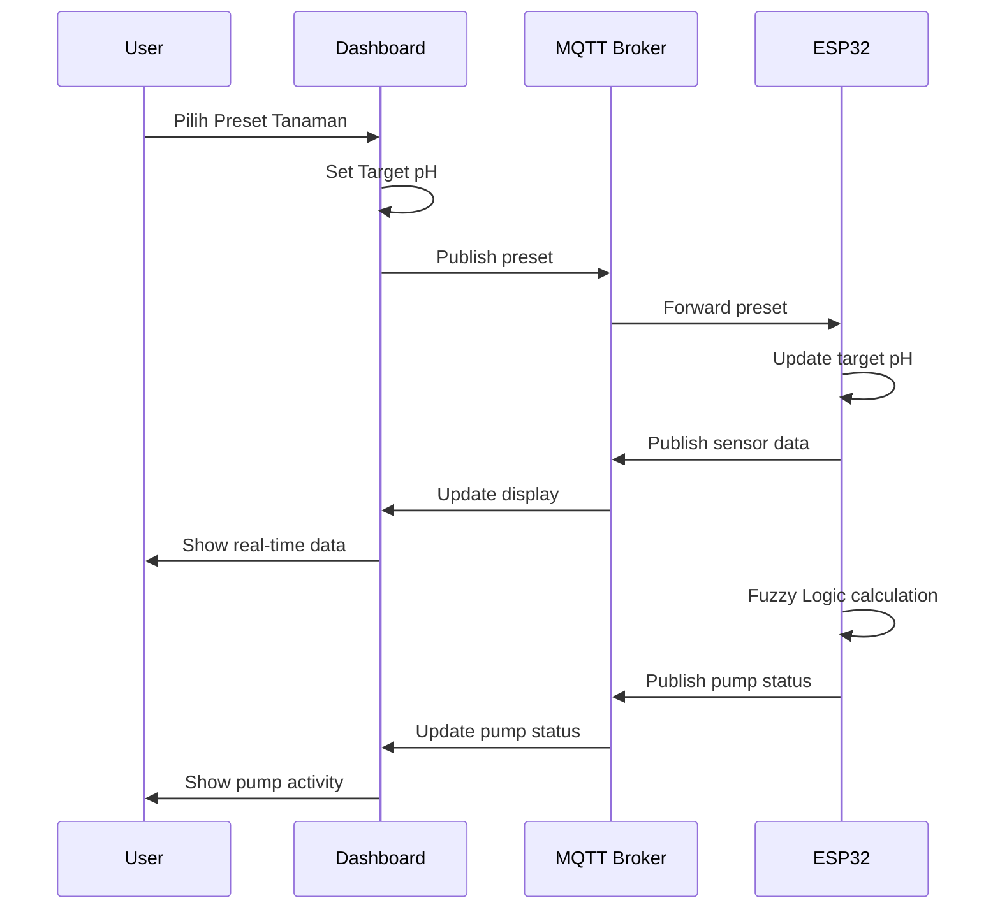

# 🌱 Hydroponic NFT Dashboard

<p align="center">
  <em>Smart Monitoring & Control System for NFT Hydroponic with ESP32, MQTT & Fuzzy Logic</em>
</p>

<p align="center">
  <!-- Status Badges -->
  
  
  
  
  
  
  
  <a href="LICENSE">
    
  </a>
</p>

<p align="center">
  
  
  
  
</p>

---

## 📑 Table of Contents

- [✨ Overview](#-overview)
- [🎯 Features](#-features)
- [🏗️ System Architecture](#️-system-architecture)
- [📁 Project Structure](#-project-structure)
- [🔌 Pin Configuration](#-pin-configuration)
- [📡 MQTT Topics](#-mqtt-topics)
- [🧠 Fuzzy Logic Controller](#-fuzzy-logic-controller)
- [🌱 Plant Presets](#-plant-presets)
- [⚙️ Installation](#️-installation)
- [🚀 Usage](#-usage)
- [📱 Responsive Design](#-responsive-design)
- [🐞 Troubleshooting](#-troubleshooting)
- [🤝 Contributing](#-contributing)
- [📄 License](#-license)

---

## ✨ Overview

**Hydroponic NFT Dashboard** adalah sistem monitoring dan kontrol untuk sistem hidroponik NFT (Nutrient Film Technique) berbasis ESP32. Dashboard ini menampilkan pembacaan sensor **TDS**, **suhu air**, dan **pH**, serta mengontrol 7 pompa secara real-time melalui MQTT.

### 🎯 Cara Kerja

1. **ESP32 membaca sensor** → pH, TDS, Suhu air
2. **Data dikirim via MQTT** → ke broker HiveMQ
3. **Dashboard menampilkan data** → real-time monitoring
4. **User kontrol pompa** → via toggle switch di dashboard
5. **Fuzzy Logic mengatur pH** → otomatis berdasarkan preset tanaman

**Keunggulan:** Sistem otomatis menjaga pH sesuai kebutuhan tanaman dengan logika fuzzy yang halus (bukan on/off), menghindari overshoot.

---

## 🎯 Features

- ✅ **Real-time Monitoring**  
  pH, TDS, Suhu air dengan visual grafik dan badge status

- ✅ **7 Pompa Kontrol**  
  Aerator, Sirkulasi (2), pH Up, pH Down, Nutrisi A, Nutrisi B

- ✅ **Fuzzy Logic pH Controller**  
  5 membership functions, auto dosing dengan kekuatan 0-100%

- ✅ **🌱 Plant Presets**  
  12 preset tanaman dengan target pH otomatis

- ✅ **MQTT Integration**  
  Koneksi ke HiveMQ public broker dengan auto-reconnect

- ✅ **Responsive Design**  
  Optimized untuk desktop, tablet, dan mobile

- ✅ **Dark Theme**  
  Tampilan modern dengan aksen hijau

---

## 🏗️ System Architecture

### 🔗 Diagram Sistem

```text
┌─────────────────┐    MQTT     ┌─────────────────┐    WiFi    ┌─────────────────┐
│   Dashboard     │ ◄─────────► │   MQTT Broker   │ ◄────────► │      ESP32      │
│   (index.html)  │             │  (HiveMQ/WSS)   │            │  (Hydroponic)   │
└─────────────────┘             └─────────────────┘            └─────────────────┘
         │                                                               │
         │ Control                                                       │
         ▼                                                               ▼
┌─────────────────┐                                            ┌─────────────────┐
│   User Input    │                                            │   Sensors       │
│  (Toggle/Preset)│                                            │  pH / TDS / Temp│
└─────────────────┘                                            └─────────────────┘
```

### 📊 Message Flow



---

## 📁 Project Structure

```text
hydroponics-monitoring/
├── 📄 index.html          # Main dashboard (single file)
├── 📖 README.md           # Documentation
└── 📄 LICENSE             # MIT License
```

> **Catatan**: Kode lengkap ada di satu file `index.html` (HTML + CSS + JS inline).

---

## 🔌 Pin Configuration

### ESP32 GPIO Mapping

```
                        +-------------------------------+
        VIN 5V -------->| VIN                           |
        GND ----------->| GND                           |
                        |                               |
   TDS AO  ------------>| GPIO35  (ADC1)    ESP32-S3    |
   Suhu DS18B20 ------->| GPIO4               DevKit    |
   pH  AO  ------------>| GPIO34  (ADC1)                |
                        |                               |
                        |  I2C:  SDA=GPIO21  SCL=GPIO22 |----> LCD 16x2 (0x27)
                        |                               |
                        |  GPIO13 ---> [Relay] ---> Pompa Aerator
                        |  GPIO14 ---> [Relay] ---> Pompa Sirkulasi 1
                        |  GPIO27 ---> [Relay] ---> Pompa Sirkulasi 2
                        |  GPIO26 ---> [Relay] ---> Pompa pH Up   (KOH 10%)
                        |  GPIO25 ---> [Relay] ---> Pompa pH Down (H₃PO₄)
                        |  GPIO33 ---> [Relay] ---> Pompa Nutrisi A
                        |  GPIO32 ---> [Relay] ---> Pompa Nutrisi B
                        +-------------------------------+
                                     |
                                     | WiFi + MQTT
                                     v
                        +-------------------------------+
                        |   Broker HiveMQ (Public)      |
                        |   broker.hivemq.com           |
                        +-------------------------------+
                                     |
                                     | WebSocket Secure (WSS :8884)
                                     v
                        +-------------------------------+
                        |   Dashboard (Browser)         |
                        +-------------------------------+

   Catatan: 
   - Gunakan modul relay aktif-LOW dan catu daya pompa terpisah dari ESP32
   - Sambungkan GND bersama (common ground)
   - GPIO34 & GPIO35 adalah Input Only (ADC1) - aman saat WiFi aktif
   - GPIO4 digunakan untuk sensor suhu DS18B20 (1-Wire)
```

### Pin Table

| Aktuator / Sensor | GPIO | Keterangan |
|-------------------|------|------------|
| **Relay 1** Aerator | 13 | Pompa udara |
| **Relay 2** Sirkulasi 1 | 14 | Pompa sirkulasi utama |
| **Relay 3** Sirkulasi 2 | 27 | Pompa sirkulasi cadangan |
| **Relay 4** pH Up | 26 | Dosis KOH 10% |
| **Relay 5** pH Down | 25 | Dosis asam (H₃PO₄) |
| **Relay 6** Nutrisi A | 33 | Dosis nutrisi A |
| **Relay 7** Nutrisi B | 32 | Dosis nutrisi B |
| Sensor TDS | 35 | ADC1 Input Only |
| Sensor pH | 34 | ADC1 Input Only |
| Sensor Suhu DS18B20 | 4 | 1-Wire digital |
| I2C SDA | 21 | LCD |
| I2C SCL | 22 | LCD |

---

## 📡 MQTT Topics

| Arah | Topik | Payload contoh |
|------|-------|----------------|
| **ESP32 → Dashboard** | | |
| ESP32 → Dash | `hydroponic/riski/sensor/ph` | `6.12` |
| ESP32 → Dash | `hydroponic/riski/sensor/tds` | `1180` |
| ESP32 → Dash | `hydroponic/riski/sensor/temp` | `24.6` |
| ESP32 → Dash | `hydroponic/riski/sensor/all` | `{"ph":6.12,"tds":1180,...}` |
| ESP32 → Dash | `hydroponic/riski/status/device` | `online` / `offline` |
| **Dashboard → ESP32** | | |
| Dash → ESP32 | `hydroponic/riski/control/aerator` | `ON` / `OFF` |
| Dash → ESP32 | `hydroponic/riski/control/sirkulasi1` | `ON` / `OFF` |
| Dash → ESP32 | `hydroponic/riski/control/sirkulasi2` | `ON` / `OFF` |
| Dash → ESP32 | `hydroponic/riski/control/phup` | `ON` / `OFF` |
| Dash → ESP32 | `hydroponic/riski/control/phdown` | `ON` / `OFF` |
| Dash → ESP32 | `hydroponic/riski/control/nutrisia` | `ON` / `OFF` |
| Dash → ESP32 | `hydroponic/riski/control/nutrisib` | `ON` / `OFF` |
| Dash → ESP32 | `hydroponic/riski/control/phmode` | `auto` / `manual` |
| Dash → ESP32 | `hydroponic/riski/control/preset` | `{"phMin":6.0,"phMax":7.0,"preset":"selada"}` |
| Dash → ESP32 | `hydroponic/riski/status/request` | `STATUS` |

---

## 🧠 Fuzzy Logic Controller

### Overview

Kendali pH memakai **Fuzzy Logic (model Sugeno orde-0)**. Error pH dikelompokkan ke dalam himpunan samar (fuzzy set) dengan derajat keanggotaan 0–1.

### 1. Variabel Masukan

```
e = pH_terukur - pH_target_tengah
pH_target_tengah = (pH_min + pH_max) / 2
```

- `e < 0` → larutan terlalu **asam** → perlu **dinaikkan** (pH Up / KOH)
- `e > 0` → larutan terlalu **basa** → perlu **diturunkan** (pH Down / asam)

### 2. Himpunan Fuzzy

```
 μ
1.0 |  AsamKuat            Netral            BasaKuat
    |  ‾‾‾‾\        /\                /\        /‾‾‾‾
    |       \      /  \  AsamLemah   /  \      /   BasaLemah
    |        \    /    \    /\      /    \    /
    |         \  /      \  /  \    /      \  /
0.0 +----------\/--------\/----\--/--------\/----------> e (pH)
       -1.0  -0.7 -0.5 -0.3 -0.15  0  0.15 0.3 0.5 0.7 1.0
```

| Himpunan | Bentuk | Titik (pH error) |
|----------|--------|------------------|
| Asam Kuat | Bahu kiri | 1 di e ≤ -1.0, 0 di e ≥ -0.5 |
| Asam Lemah | Segitiga | (-0.7, -0.3, -0.05) |
| Netral | Segitiga | (-0.15, 0, 0.15) |
| Basa Lemah | Segitiga | (0.05, 0.3, 0.7) |
| Basa Kuat | Bahu kanan | 0 di e ≤ 0.5, 1 di e ≥ 1.0 |

### 3. Basis Aturan

| No | JIKA pH termasuk | MAKA keluaran (out) | Arti |
|----|------------------|---------------------|------|
| R1 | Asam Kuat | +1.0 | Naikkan pH kuat (pH Up) |
| R2 | Asam Lemah | +0.5 | Naikkan pH lembut |
| R3 | Netral | 0.0 | Diam, kedua pompa mati |
| R4 | Basa Lemah | -0.5 | Turunkan pH lembut |
| R5 | Basa Kuat | -1.0 | Turunkan pH kuat (pH Down) |

### 4. Defuzzifikasi

```
crisp = Σ(μᵢ × outᵢ) / Σ μᵢ    (rentang -1 … +1)
```

Keputusan aktuator:
- `crisp > 0.08` → pompa pH Up ON
- `crisp < -0.08` → pompa pH Down ON
- selain itu → kedua pompa OFF (deadband / zona aman)

### 5. Contoh Pengujian (target pH 5.8–6.3 → tengah 6.05)

| pH terukur | e = pH-6.05 | Kelompok dominan | crisp | Aksi | Kekuatan |
|------------|-------------|------------------|-------|------|----------|
| 4.90 | -1.15 | Asam Kuat | +1.00 | pH Up | 100% |
| 5.55 | -0.50 | Asam Lemah | +0.50 | pH Up | 50% |
| 6.05 | 0.00 | Netral | 0.00 | Idle | 0% |
| 6.55 | +0.50 | Basa Lemah | -0.50 | pH Down | 50% |
| 7.20 | +1.15 | Basa Kuat | -1.00 | pH Down | 100% |

---

## 🌱 Plant Presets

User dapat memilih jenis tanaman dari dropdown, dan sistem **otomatis mengatur target pH**.

| Tanaman | pH Min | pH Max |
|---------|--------|--------|
| 🥬 Selada | 6.0 | 7.0 |
| 🌿 Sawi | 5.5 | 6.5 |
| 🌱 Kangkung | 5.5 | 6.5 |
| 🍃 Bayam | 6.0 | 7.0 |
| 🥦 Kailan | 5.5 | 6.5 |
| 🥬 Pakcoy | 6.8 | 7.0 |
| 🌿 Seledri | 6.3 | 6.7 |
| 🌶️ Cabe | 6.0 | 6.5 |
| 🌿 Peterseli | 5.5 | 6.0 |
| 🍓 Strawberry | 5.8 | 6.2 |
| 🥒 Ketimun | 5.3 | 5.7 |
| 🎯 Manual | 5.8 | 6.3 |

---

## ⚙️ Installation

### 1. Clone Repository

```bash
git clone https://github.com/ficrammanifur/hydroponics-monitoring.git
cd hydroponics-monitoring
```

### 2. Deploy Web Interface

#### Option A: GitHub Pages

1. Push ke repository GitHub
2. Settings → Pages → Deploy from branch
3. Select branch: main, folder: / (root)

**Access URL:** `https://ficrammanifur.github.io/hydroponics-monitoring/`

#### Option B: Local Development

```bash
# Python
python -m http.server 8080

# Node.js
npx serve .

# PHP
php -S localhost:8080
```

**Access URL:** `http://localhost:8080`

### 3. ESP32 Configuration

Upload `esp32/filling_machine.ino` ke ESP32 dengan konfigurasi:

```cpp
// WiFi Configuration
const char* WIFI_SSID = "Wokwi-GUEST";  // Untuk Wokwi
const char* WIFI_PASSWORD = "";

// MQTT Configuration
const char* MQTT_BROKER = "broker.hivemq.com";
const int MQTT_PORT = 1883;
```

---

## 🚀 Usage

### Step-by-Step Operation

1. **🌐 Open Dashboard**
   ```
   https://yourdomain.com/index.html
   ```

2. **📊 Monitor Data**
   - pH, TDS, Suhu ditampilkan real-time
   - Status koneksi MQTT & ESP32

3. **🌱 Pilih Preset Tanaman**
   - Dropdown → pilih tanaman
   - Target pH otomatis berubah

4. **🎯 Kontrol Pompa**
   - Toggle switch ON/OFF
   - Status pompa real-time

5. **🧠 Auto pH Control**
   - Mode Auto → Fuzzy Logic aktif
   - Sistem menjaga pH otomatis

---

## 📱 Responsive Design

Dashboard mendukung:
- ✅ Desktop (>= 1024px)
- ✅ Tablet (768px - 1024px)
- ✅ Mobile (<= 480px)

---

## 🐞 Troubleshooting

### ❌ Common Issues

#### **MQTT Connection Failed**
```javascript
// Check browser console
console.log('MQTT status:', client.connected);

// Try alternative brokers
const BROKERS = [
    'wss://broker.hivemq.com:8884/mqtt',
    'wss://test.mosquitto.org:8081/mqtt',
    'wss://broker.emqx.io:8084/mqtt'
];
```

#### **ESP32 Tidak Online**
- ✅ Periksa koneksi WiFi ESP32
- ✅ Pastikan MQTT broker sama
- ✅ Cek Serial Monitor

#### **pH Tidak Stabil**
- ✅ Kalibrasi sensor pH
- ✅ Cek koneksi sensor
- ✅ Periksa nilai target pH

---

## 🤝 Contributing

Kontribusi sangat diterima! Silakan:

1. **Fork** repository
2. **Create** feature branch
3. **Commit** changes
4. **Push** to branch
5. **Open** Pull Request

---

## 📄 License

MIT License - Gunakan secara bebas untuk keperluan edukasi dan pengembangan.

---

<div align="center">

**⚡ Built with ESP32, MQTT & Fuzzy Logic**

**🌱 Making hydroponics smarter and more automated**

**⭐ Star this repo if you like it!**

<p><a href="#top">⬆ Kembali ke Atas</a></p>

</div>
