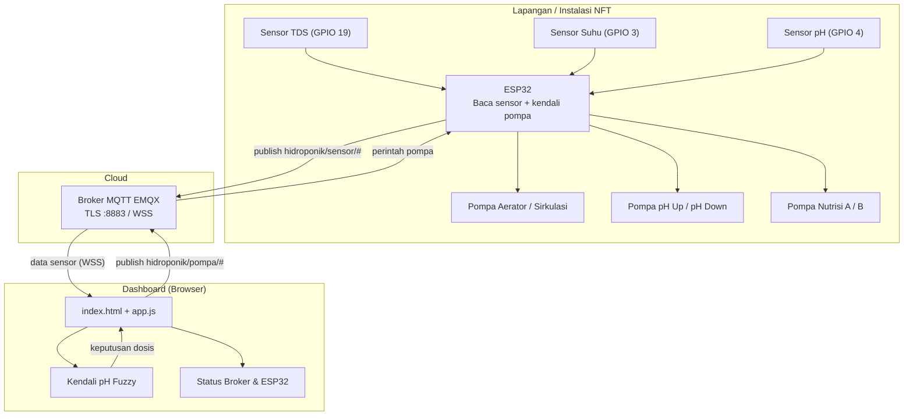
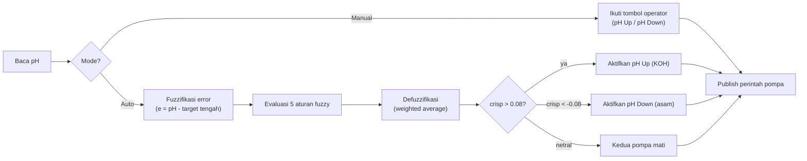

# Dashboard Monitoring Hidroponik NFT

Dashboard statis (HTML + CSS + JS) untuk memantau dan mengendalikan sistem
hidroponik NFT berbasis ESP32. Menampilkan pembacaan sensor **TDS**, **suhu air**,
dan **pH**, status koneksi **broker MQTT** & **ESP32**, kontrol pompa, serta
**kendali pH otomatis berbasis logika fuzzy**.

> Data saat ini disimulasikan untuk demo. Ganti blok `SIMULASI` di `app.js`
> dengan klien MQTT (mqtt.js over WebSocket/WSS) untuk data ESP32 real-time.

---

## Struktur Berkas

```
.
├── index.html      # Struktur halaman & tata letak
├── styles.css      # Tema hijau hidroponik, komponen, animasi status
├── app.js          # State, simulasi sensor, status broker/ESP32, kendali pH fuzzy
└── README.md       # Dokumen ini
```

Buka `index.html` langsung di browser, atau jalankan static server
(`npx serve .`) lalu buka alamat yang tertera.

---

## Spesifikasi Perangkat

| Item              | Nilai                                    |
| ----------------- | ---------------------------------------- |
| Broker MQTT       | `c68f1f76.ala.us-east-1.emqxsl.com`      |
| Port              | `8883` (TLS)                             |
| User / Client ID  | `rizky_esp32`                            |
| LCD               | I2C `0x27`, 16x2 (SDA=8, SCL=9)          |

### Pemetaan Pin (GPIO)

| Aktuator / Sensor | GPIO | Keterangan               |
| ----------------- | ---- | ------------------------ |
| Aerator           | 12   | Pompa udara              |
| Sirkulasi 1       | 13   | Pompa sirkulasi utama    |
| Sirkulasi 2       | 11   | Pompa sirkulasi cadangan |
| pH Up             | 10   | Dosis KOH 10%            |
| pH Down           | 46   | Dosis asam (H₃PO₄)       |
| Nutrisi A         | 14   | Dosis nutrisi A          |
| Nutrisi B         | 17   | Dosis nutrisi B          |
| Sensor TDS        | 19   | Analog                   |
| Sensor Suhu       | 3    | DS18B20 / analog         |
| Sensor pH         | 4    | Analog                   |

---

## Diagram Alur Sistem (Mermaid)



### Alur Kendali pH (Mermaid)



---

## Diagram Rangkaian ESP32 (ASCII)

```
                         +-------------------------------+
        VIN 5V --------->| VIN                           |
        GND ----------->| GND                           |
                        |                                |
   TDS AO  ------------>| GPIO19  (ADC)     ESP32-S3     |
   Suhu DS18B20 ------->| GPIO3             DevKit       |
   pH  AO  ------------>| GPIO4   (ADC)                  |
                        |                                |
                        |  I2C:  SDA=GPIO8   SCL=GPIO9   |----> LCD 16x2 (0x27)
                        |                                |
                        |  GPIO12 ---> [Relay] ---> Pompa Aerator
                        |  GPIO13 ---> [Relay] ---> Pompa Sirkulasi 1
                        |  GPIO11 ---> [Relay] ---> Pompa Sirkulasi 2
                        |  GPIO10 ---> [Relay] ---> Pompa pH Up   (KOH 10%)
                        |  GPIO46 ---> [Relay] ---> Pompa pH Down (H3PO4)
                        |  GPIO14 ---> [Relay] ---> Pompa Nutrisi A
                        |  GPIO17 ---> [Relay] ---> Pompa Nutrisi B
                        +-------------------------------+
                                     |
                                     | WiFi + MQTT/TLS :8883
                                     v
                        +-------------------------------+
                        |   Broker EMQX (Cloud)         |
                        |   c68f1f76.ala...emqxsl.com   |
                        +-------------------------------+
                                     |
                                     | WebSocket (WSS)
                                     v
                        +-------------------------------+
                        |   Dashboard (Browser)         |
                        +-------------------------------+

   Catatan: gunakan modul relay aktif-LOW dan catu daya pompa terpisah
   dari ESP32. Sambungkan GND bersama (common ground).
```

---

## Skema Topik MQTT (saran)

| Arah          | Topik                         | Payload contoh        |
| ------------- | ----------------------------- | --------------------- |
| ESP32 → Dash  | `hidroponik/sensor/tds`       | `1180`                |
| ESP32 → Dash  | `hidroponik/sensor/suhu`      | `24.6`                |
| ESP32 → Dash  | `hidroponik/sensor/ph`        | `6.12`                |
| ESP32 → Dash  | `hidroponik/status/heartbeat` | `online` (LWT `off`)  |
| Dash → ESP32  | `hidroponik/pompa/aerator`    | `ON` / `OFF`          |
| Dash → ESP32  | `hidroponik/pompa/phUp`       | `ON` / `OFF`          |
| Dash → ESP32  | `hidroponik/pompa/nutrisi_a`  | `ON` / `OFF`          |

**Deteksi status ESP32:** gunakan *Last Will & Testament* (LWT) pada
`hidroponik/status/heartbeat`. Broker otomatis mengirim `off` bila ESP32
terputus, sehingga dashboard menandai perangkat **Tidak Aktif**.

---

## Metode Fuzzy — Kendali & Pengelompokan pH

Kendali pH memakai **Fuzzy Logic (model Sugeno orde-0)**. Prinsipnya:
error pH tidak diperlakukan sebagai angka kaku, melainkan **dikelompokkan**
ke dalam himpunan samar (fuzzy set) dengan derajat keanggotaan 0–1.

### 1. Variabel Masukan

```
e = pH_terukur - pH_target_tengah      (pH_target_tengah = (min + max) / 2)
```

- `e < 0`  → larutan terlalu **asam** → perlu **dinaikkan** (pH Up / KOH)
- `e > 0`  → larutan terlalu **basa** → perlu **diturunkan** (pH Down / asam)

### 2. Himpunan Fuzzy (Fuzzifikasi / Pengelompokan)

Lima kelompok dengan fungsi keanggotaan segitiga & bahu (shoulder):

```
 μ
1.0 |  AsamKuat            Netral            BasaKuat
    |  ‾‾‾‾\        /\                /\        /‾‾‾‾
    |       \      /  \  AsamLemah   /  \      /   BasaLemah
    |        \    /    \    /\      /    \    /
    |         \  /      \  /  \    /      \  /
0.0 +----------\/--------\/----\--/--------\/----------> e (pH)
       -1.0  -0.7 -0.5 -0.3 -0.15  0  0.15 0.3 0.5 0.7 1.0
```

| Himpunan     | Bentuk        | Titik (pH error)        |
| ------------ | ------------- | ----------------------- |
| Asam Kuat    | Bahu kiri     | 1 di e≤-1.0, 0 di e≥-0.5|
| Asam Lemah   | Segitiga      | (-0.7, -0.3, -0.05)     |
| Netral       | Segitiga      | (-0.15, 0, 0.15)        |
| Basa Lemah   | Segitiga      | (0.05, 0.3, 0.7)        |
| Basa Kuat    | Bahu kanan    | 0 di e≤0.5, 1 di e≥1.0  |

### 3. Basis Aturan (Rule Base)

| No | JIKA pH termasuk | MAKA keluaran (out) | Arti                        |
| -- | ---------------- | ------------------- | --------------------------- |
| R1 | Asam Kuat        | +1.0                | Naikkan pH kuat (pH Up)     |
| R2 | Asam Lemah       | +0.5                | Naikkan pH lembut           |
| R3 | Netral           |  0.0                | Diam, kedua pompa mati      |
| R4 | Basa Lemah       | −0.5                | Turunkan pH lembut          |
| R5 | Basa Kuat        | −1.0                | Turunkan pH kuat (pH Down)  |

### 4. Defuzzifikasi (Weighted Average)

```
            Σ ( μᵢ × outᵢ )
crisp  =  ------------------          (rentang -1 … +1)
              Σ μᵢ
```

Keputusan aktuator:

```
crisp >  0.08   → pompa pH Up   ON   (dosis KOH)
crisp < -0.08   → pompa pH Down ON   (dosis asam)
selain itu      → kedua pompa OFF (zona aman / deadband)
```

Nilai `|crisp|` juga dipakai sebagai **kekuatan dosis** (0–100%): makin jauh
dari target, makin besar laju perubahan pH per siklus.

### 5. Pengujian & Pengelompokan (contoh, target pH 5.8–6.3 → tengah 6.05)

| pH terukur | e = pH-6.05 | Kelompok dominan | crisp | Aksi        | Kekuatan |
| ---------- | ----------- | ---------------- | ----- | ----------- | -------- |
| 4.90       | −1.15       | Asam Kuat        | +1.00 | pH Up       | 100%     |
| 5.55       | −0.50       | Asam Lemah       | +0.50 | pH Up       | 50%      |
| 6.05       |  0.00       | Netral           |  0.00 | Idle        | 0%       |
| 6.55       | +0.50       | Basa Lemah       | −0.50 | pH Down     | 50%      |
| 7.20       | +1.15       | Basa Kuat        | −1.00 | pH Down     | 100%     |
| 6.10       | +0.05       | Netral∩BasaLemah | ~−0.03| Idle (aman) | ~3%      |

Kesimpulan pengujian: sistem mengelompokkan kondisi larutan secara halus
(bukan sekadar on/off), sehingga dosis mendekati target menjadi lembut dan
menghindari *overshoot* — sesuai anjuran menambahkan KOH/asam
**sedikit demi sedikit** hingga pH tercapai.

---

## Menyambungkan ke MQTT Nyata

Ganti loop simulasi di `app.js` dengan klien MQTT over WebSocket:

```html
<script src="https://unpkg.com/mqtt/dist/mqtt.min.js"></script>
```

```js
const client = mqtt.connect("wss://c68f1f76.ala.us-east-1.emqxsl.com:8084/mqtt", {
  username: "rizky_esp32",
  password: "••••••••",
  clientId: "dashboard_" + Math.random().toString(16).slice(2),
});

client.on("connect", () => {
  state.broker = "online";
  renderConnStatus();
  client.subscribe("hidroponik/sensor/#");
  client.subscribe("hidroponik/status/heartbeat");
});

client.on("message", (topic, msg) => {
  const val = msg.toString();
  if (topic === "hidroponik/sensor/tds") state.values.tds = parseFloat(val);
  if (topic === "hidroponik/sensor/suhu") state.values.temp = parseFloat(val);
  if (topic === "hidroponik/sensor/ph") state.values.ph = parseFloat(val);
  if (topic === "hidroponik/status/heartbeat") state.esp = val === "online" ? "active" : "inactive";
  renderSensors();
  renderPhPanel();
  renderConnStatus();
});

client.on("close", () => { state.broker = "offline"; renderConnStatus(); });

// arahkan publish() ke client.publish(topic, payload, { qos: 1 })
```

> Port `8883` untuk MQTT/TLS (dipakai ESP32). Untuk browser gunakan endpoint
> **WebSocket Secure** broker (umumnya port `8084` path `/mqtt`).
