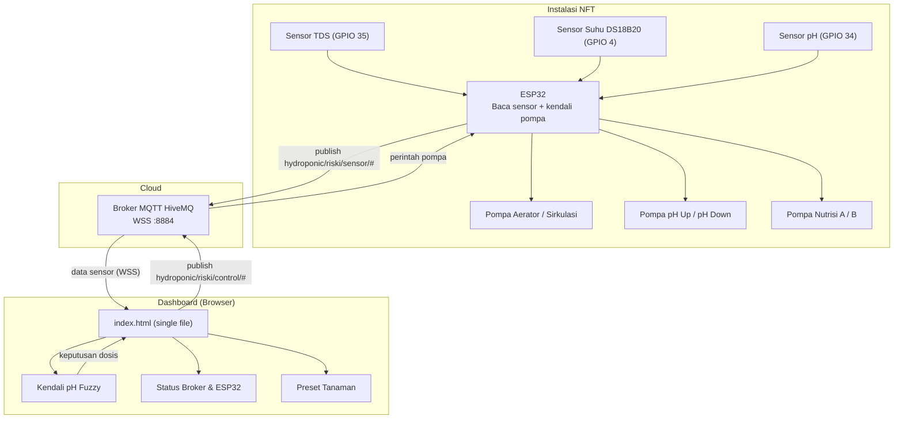
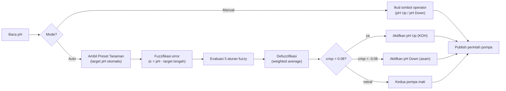

Baik, saya perbaiki README.md dengan fokus pada **Fuzzy Logic** dan **diagram ASCII** yang lebih jelas. Saya gabungkan semua yang Anda minta:

---

# Dashboard Monitoring Hidroponik NFT

Dashboard statis (HTML + CSS + JS) untuk memantau dan mengendalikan sistem hidroponik NFT berbasis ESP32. Menampilkan pembacaan sensor **TDS**, **suhu air**, dan **pH**, status koneksi **broker MQTT** & **ESP32**, kontrol pompa, serta **kendali pH otomatis berbasis logika fuzzy** dengan **Preset Tanaman**.

> **Data real-time** dari ESP32 via MQTT over WebSocket (WSS). Dashboard terhubung ke broker HiveMQ public.

---

## 📸 Tampilan Dashboard

| Komponen | Deskripsi |
|----------|-----------|
| **Header** | Brand, status koneksi MQTT & ESP32, jam real-time |
| **Conn Bar** | Host, port, client ID, uptime, packet count, tombol reconnect |
| **Status Air** | Indikator kualitas air (LAYAK / ASAM / BASA) dengan ikon |
| **Parameter Sensor** | pH, TDS, Suhu dengan badge status (Normal / Warn) |
| **Kontrol Pompa** | 7 toggle switch untuk kontrol pompa (Aerator, Sirkulasi, Nutrisi, pH) |
| **Kontrol pH & Preset Tanaman** | Dropdown preset tanaman, visual range pH, fuzzy strength, mode auto/manual |
| **Data Telemetry** | Raw JSON dari ESP32 untuk debugging |

---

## 🌱 Fitur Preset Tanaman

User dapat memilih jenis tanaman dari dropdown, dan sistem **otomatis mengatur target pH** sesuai kebutuhan optimal tanaman.

| Tanaman | pH Min | pH Max |
|---------|--------|--------|
| 🥬 Selada | 6.0 | 7.0 |
| 🌿 Sawi | 5.5 | 6.5 |
| 🌱 Kangkung | 5.5 | 6.5 |
| 🍃 Bayam | 6.0 | 7.0 |
| 🥦 Kailan | 5.5 | 6.5 |
| 🥬 Pakcoy | 6.8 | 7.0 |
| 🌿 Seledri | 6.3 | 6.7 |
| 🌶️ Cabe | 6.0 | 6.5 |
| 🌿 Peterseli | 5.5 | 6.0 |
| 🍓 Strawberry | 5.8 | 6.2 |
| 🥒 Ketimun | 5.3 | 5.7 |
| 🎯 Manual | 5.8 | 6.3 |

---

## 📁 Struktur Berkas

```
.
├── index.html      # Struktur halaman & tata letak (single file)
└── README.md       # Dokumentasi ini
```

> **Catatan**: Kode lengkap ada di satu file `index.html` (HTML + CSS + JS inline). Buka langsung di browser atau jalankan static server (`npx serve .` atau `python -m http.server`).

---

## 🔌 Spesifikasi Perangkat

| Item | Nilai |
|------|-------|
| Mikrokontroler | ESP32 / ESP32-S3 |
| Broker MQTT | `broker.hivemq.com` (public) |
| Port | `8884` (WSS / WebSocket Secure) |
| Client ID | `dash_xxxxxxxx` (random generated) |
| LCD | I2C `0x27`, 16x2 (SDA=21, SCL=22) |

### Pemetaan Pin (GPIO)

| Aktuator / Sensor | GPIO | Keterangan |
|-------------------|------|------------|
| **Relay 1** Aerator | 13 | Pompa udara |
| **Relay 2** Sirkulasi 1 | 14 | Pompa sirkulasi utama |
| **Relay 3** Sirkulasi 2 | 27 | Pompa sirkulasi cadangan |
| **Relay 4** pH Up | 26 | Dosis KOH 10% |
| **Relay 5** pH Down | 25 | Dosis asam (H₃PO₄) |
| **Relay 6** Nutrisi A | 33 | Dosis nutrisi A |
| **Relay 7** Nutrisi B | 32 | Dosis nutrisi B |
| Sensor TDS | 35 | ADC1 Input Only (aman WiFi) |
| Sensor pH | 34 | ADC1 Input Only (aman WiFi) |
| Sensor Suhu DS18B20 | 4 | 1-Wire digital |
| I2C SDA | 21 | LCD |
| I2C SCL | 22 | LCD |

---

## 📡 Diagram Rangkaian ESP32 (ASCII)

```
                        +-------------------------------+
        VIN 5V -------->| VIN                           |
        GND ----------->| GND                           |
                        |                               |
   TDS AO  ------------>| GPIO35  (ADC1)    ESP32-S3    |
   Suhu DS18B20 ------->| GPIO4               DevKit    |
   pH  AO  ------------>| GPIO34  (ADC1)                |
                        |                               |
                        |  I2C:  SDA=GPIO21  SCL=GPIO22 |----> LCD 16x2 (0x27)
                        |                               |
                        |  GPIO13 ---> [Relay] ---> Pompa Aerator
                        |  GPIO14 ---> [Relay] ---> Pompa Sirkulasi 1
                        |  GPIO27 ---> [Relay] ---> Pompa Sirkulasi 2
                        |  GPIO26 ---> [Relay] ---> Pompa pH Up   (KOH 10%)
                        |  GPIO25 ---> [Relay] ---> Pompa pH Down (H₃PO₄)
                        |  GPIO33 ---> [Relay] ---> Pompa Nutrisi A
                        |  GPIO32 ---> [Relay] ---> Pompa Nutrisi B
                        +-------------------------------+
                                     |
                                     | WiFi + MQTT
                                     v
                        +-------------------------------+
                        |   Broker HiveMQ (Public)      |
                        |   broker.hivemq.com           |
                        +-------------------------------+
                                     |
                                     | WebSocket Secure (WSS :8884)
                                     v
                        +-------------------------------+
                        |   Dashboard (Browser)         |
                        +-------------------------------+

   Catatan: 
   - Gunakan modul relay aktif-LOW dan catu daya pompa terpisah dari ESP32
   - Sambungkan GND bersama (common ground)
   - GPIO34 & GPIO35 adalah Input Only (ADC1) - aman saat WiFi aktif
   - GPIO4 digunakan untuk sensor suhu DS18B20 (1-Wire)
```

---

## 📡 Skema Topik MQTT

| Arah | Topik | Payload contoh |
|------|-------|----------------|
| **ESP32 → Dashboard** | | |
| ESP32 → Dash | `hydroponic/riski/sensor/ph` | `6.12` |
| ESP32 → Dash | `hydroponic/riski/sensor/tds` | `1180` |
| ESP32 → Dash | `hydroponic/riski/sensor/temp` | `24.6` |
| ESP32 → Dash | `hydroponic/riski/sensor/all` | `{"ph":6.12,"tds":1180,...}` |
| ESP32 → Dash | `hydroponic/riski/status/device` | `online` / `offline` |
| ESP32 → Dash | `hydroponic/riski/status/aerator` | `ON` / `OFF` |
| ESP32 → Dash | `hydroponic/riski/status/sirkulasi1` | `ON` / `OFF` |
| ESP32 → Dash | `hydroponic/riski/status/sirkulasi2` | `ON` / `OFF` |
| ESP32 → Dash | `hydroponic/riski/status/phup` | `ON` / `OFF` |
| ESP32 → Dash | `hydroponic/riski/status/phdown` | `ON` / `OFF` |
| ESP32 → Dash | `hydroponic/riski/status/nutrisia` | `ON` / `OFF` |
| ESP32 → Dash | `hydroponic/riski/status/nutrisib` | `ON` / `OFF` |
| **Dashboard → ESP32** | | |
| Dash → ESP32 | `hydroponic/riski/control/aerator` | `ON` / `OFF` |
| Dash → ESP32 | `hydroponic/riski/control/sirkulasi1` | `ON` / `OFF` |
| Dash → ESP32 | `hydroponic/riski/control/sirkulasi2` | `ON` / `OFF` |
| Dash → ESP32 | `hydroponic/riski/control/phup` | `ON` / `OFF` |
| Dash → ESP32 | `hydroponic/riski/control/phdown` | `ON` / `OFF` |
| Dash → ESP32 | `hydroponic/riski/control/nutrisia` | `ON` / `OFF` |
| Dash → ESP32 | `hydroponic/riski/control/nutrisib` | `ON` / `OFF` |
| Dash → ESP32 | `hydroponic/riski/control/phmode` | `auto` / `manual` |
| Dash → ESP32 | `hydroponic/riski/control/preset` | `{"phMin":6.0,"phMax":7.0,"preset":"selada"}` |
| Dash → ESP32 | `hydroponic/riski/status/request` | `STATUS` |

---

## 🧠 Metode Fuzzy — Kendali pH Otomatis

Kendali pH memakai **Fuzzy Logic (model Sugeno orde-0)**. Prinsipnya: error pH tidak diperlakukan sebagai angka kaku, melainkan **dikelompokkan** ke dalam himpunan samar (fuzzy set) dengan derajat keanggotaan 0–1.

### 1. Variabel Masukan

```
e = pH_terukur - pH_target_tengah
pH_target_tengah = (pH_min + pH_max) / 2
```

- `e < 0` → larutan terlalu **asam** → perlu **dinaikkan** (pH Up / KOH)
- `e > 0` → larutan terlalu **basa** → perlu **diturunkan** (pH Down / asam)

### 2. Himpunan Fuzzy (Fuzzifikasi / Pengelompokan)

Lima kelompok dengan fungsi keanggotaan segitiga & bahu (shoulder):

```
 μ
1.0 |  AsamKuat            Netral            BasaKuat
    |  ‾‾‾‾\        /\                /\        /‾‾‾‾
    |       \      /  \  AsamLemah   /  \      /   BasaLemah
    |        \    /    \    /\      /    \    /
    |         \  /      \  /  \    /      \  /
0.0 +----------\/--------\/----\--/--------\/----------> e (pH)
       -1.0  -0.7 -0.5 -0.3 -0.15  0  0.15 0.3 0.5 0.7 1.0
```

| Himpunan | Bentuk | Titik (pH error) |
|----------|--------|------------------|
| Asam Kuat | Bahu kiri | 1 di e ≤ -1.0, 0 di e ≥ -0.5 |
| Asam Lemah | Segitiga | (-0.7, -0.3, -0.05) |
| Netral | Segitiga | (-0.15, 0, 0.15) |
| Basa Lemah | Segitiga | (0.05, 0.3, 0.7) |
| Basa Kuat | Bahu kanan | 0 di e ≤ 0.5, 1 di e ≥ 1.0 |

### 3. Basis Aturan (Rule Base)

| No | JIKA pH termasuk | MAKA keluaran (out) | Arti |
|----|------------------|---------------------|------|
| R1 | Asam Kuat | +1.0 | Naikkan pH kuat (pH Up) |
| R2 | Asam Lemah | +0.5 | Naikkan pH lembut |
| R3 | Netral | 0.0 | Diam, kedua pompa mati |
| R4 | Basa Lemah | -0.5 | Turunkan pH lembut |
| R5 | Basa Kuat | -1.0 | Turunkan pH kuat (pH Down) |

### 4. Defuzzifikasi (Weighted Average)

```
            Σ ( μᵢ × outᵢ )
crisp  =  ------------------          (rentang -1 … +1)
              Σ μᵢ
```

Keputusan aktuator:

```
crisp >  0.08   → pompa pH Up   ON   (dosis KOH)
crisp < -0.08   → pompa pH Down ON   (dosis asam)
selain itu      → kedua pompa OFF (zona aman / deadband)
```

Nilai `|crisp|` juga dipakai sebagai **kekuatan dosis** (0–100%): makin jauh dari target, makin besar laju perubahan pH per siklus.

### 5. Pengujian & Pengelompokan (contoh, target pH 5.8–6.3 → tengah 6.05)

| pH terukur | e = pH-6.05 | Kelompok dominan | crisp | Aksi | Kekuatan |
|------------|-------------|------------------|-------|------|----------|
| 4.90 | -1.15 | Asam Kuat | +1.00 | pH Up | 100% |
| 5.55 | -0.50 | Asam Lemah | +0.50 | pH Up | 50% |
| 6.05 | 0.00 | Netral | 0.00 | Idle | 0% |
| 6.55 | +0.50 | Basa Lemah | -0.50 | pH Down | 50% |
| 7.20 | +1.15 | Basa Kuat | -1.00 | pH Down | 100% |
| 6.10 | +0.05 | Netral∩BasaLemah | ~-0.03 | Idle (aman) | ~3% |

**Kesimpulan pengujian:** sistem mengelompokkan kondisi larutan secara halus (bukan sekadar on/off), sehingga dosis mendekati target menjadi lembut dan menghindari *overshoot* — sesuai anjuran menambahkan KOH/asam **sedikit demi sedikit** hingga pH tercapai.

---

## 🔄 Diagram Alur Sistem



### Alur Kendali pH



---

## 🔌 Menyambungkan ke ESP32

### ESP32 (.ino) - Topik yang digunakan:

```cpp
// Publikasi sensor (setiap 5 detik)
client.publish("hydroponic/riski/sensor/ph", String(phValue).c_str());
client.publish("hydroponic/riski/sensor/tds", String(tdsValue).c_str());
client.publish("hydroponic/riski/sensor/temp", String(tempValue).c_str());

// JSON lengkap
StaticJsonDocument<512> doc;
doc["ph"] = phValue;
doc["tds"] = tdsValue;
doc["temperature"] = tempValue;
doc["aerator"] = pumpState[0] ? "ON" : "OFF";
// ... semua pompa
serializeJson(doc, jsonBuffer);
client.publish("hydroponic/riski/sensor/all", jsonBuffer);

// Status device
client.publish("hydroponic/riski/status/device", "online");

// Subscribe kontrol
client.subscribe("hydroponic/riski/control/#");
client.subscribe("hydroponic/riski/status/request");
```

### Dashboard - Koneksi MQTT:

```javascript
const client = mqtt.connect("wss://broker.hivemq.com:8884/mqtt", {
    clientId: "dash_" + Math.random().toString(16).substr(2, 8),
    clean: true,
    reconnectPeriod: 3000,
    keepAlive: 60,
    connectTimeout: 15000
});

client.on("connect", () => {
    client.subscribe("hydroponic/riski/#");
    client.publish("hydroponic/riski/status/request", "STATUS");
});

client.on("message", (topic, payload) => {
    // Handle data dari ESP32
    handleMessage(topic, payload.toString());
});
```

---

## 🚀 Cara Menjalankan

1. **Clone atau download** file `index.html`
2. **Buka langsung** di browser modern (Chrome, Firefox, Edge)
3. Atau jalankan static server:
   ```bash
   npx serve .
   # atau
   python -m http.server 8080
   ```
4. Buka `http://localhost:8080`

> **Pastikan ESP32 sudah terhubung ke broker HiveMQ** dan mempublikasikan data ke topik `hydroponic/riski/#`.

---

## 📱 Responsive Design

Dashboard mendukung:
- ✅ Desktop (>= 1024px)
- ✅ Tablet (768px - 1024px)
- ✅ Mobile (<= 480px)

---

## 📝 Catatan

- Dashboard menggunakan **WSS (WebSocket Secure)** untuk koneksi MQTT
- Data ditampilkan **real-time** dari ESP32
- **Fuzzy Logic** berjalan di sisi dashboard (bisa dipindah ke ESP32)
- **Preset Tanaman** mengirim target pH ke ESP32 via MQTT
- Semua kontrol pompa mengirim perintah **ON/OFF** ke ESP32

---

## 📄 Lisensi

MIT License - Gunakan secara bebas untuk keperluan edukasi dan pengembangan.

---

**Dibuat dengan ❤️ untuk sistem hidroponik NFT** 🌱
